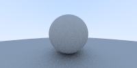

# Ray Traycing

A ray tracer implemented in Rust, following ["Ray Tracing in One Weekend"](https://raytracing.github.io/books/RayTracingInOneWeekend.html) by Peter Shirley.

Built as a learning project to explore Rust concepts through graphics programming.

## Output



## Build & Run

```bash
cargo run        # renders to output.png
cargo test       # run unit tests
```

## Project Structure

```
src/
  main.rs          — scene setup and render loop
  vector/mod.rs    — Vec3 with arithmetic ops
  ray/mod.rs       — Ray, Sphere, Hit trait, HitList
  camera/mod.rs    — Camera (viewport, ray generation)
  material/mod.rs  — Material trait, Lambertian, Metal
```
